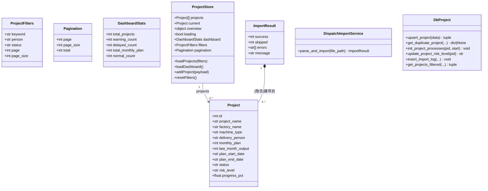
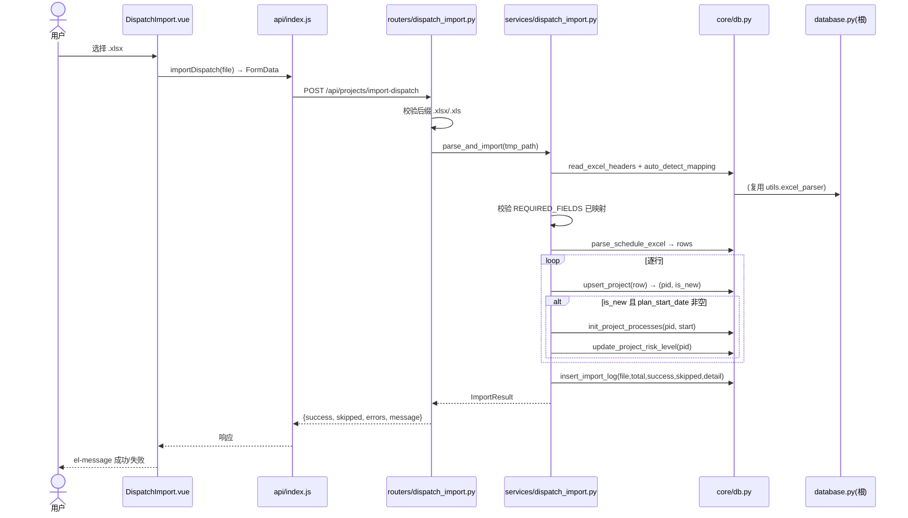
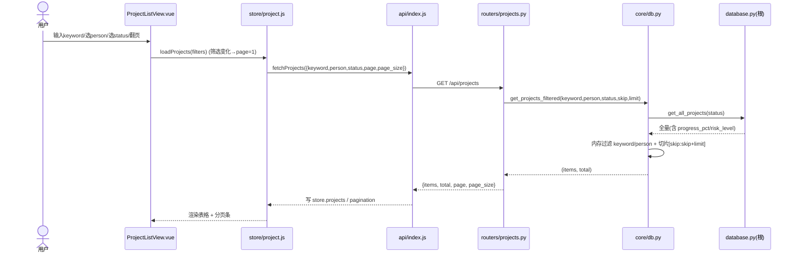
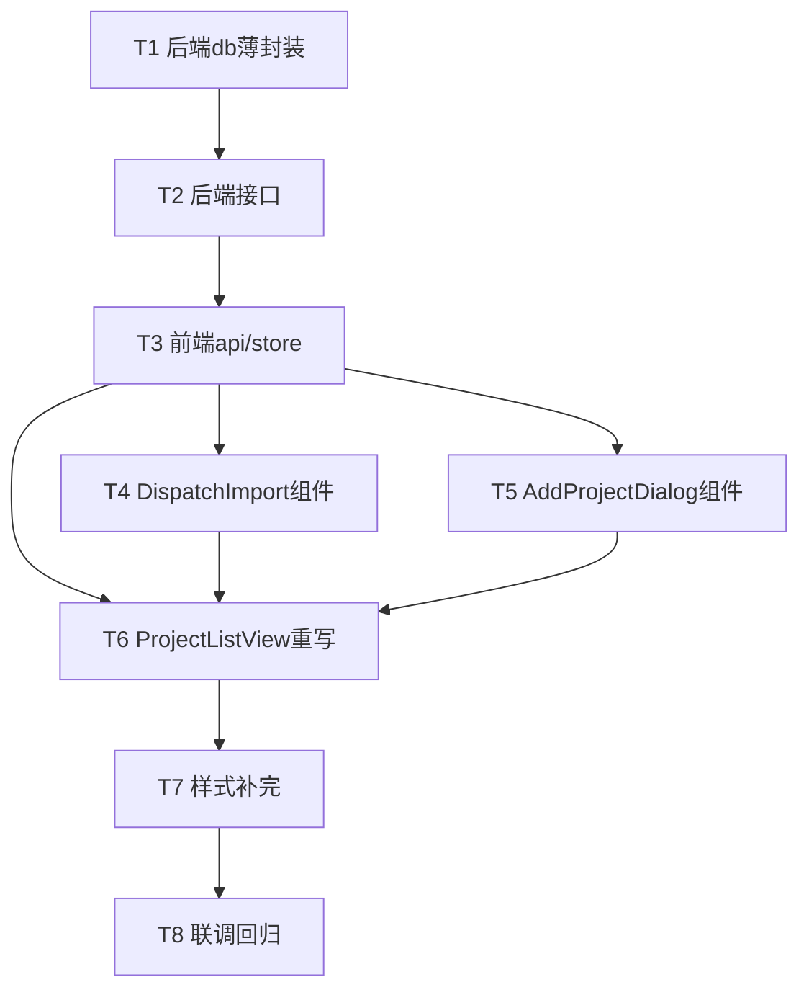

# 塔筒生产进度管控系统 · 增量架构设计 + 任务分解（主页面迁移）

> 架构师：高见远 ｜ 主理人：齐活林 ｜ 版本：v1.0（增量）
> 范围：将原 `app.py` 的 `main()` 中「数据概览 / 月度调度令 Excel 导入（建项目）/ 项目列表（搜索·筛选·分页·手动添加）/ 排版卡片化」迁移到 Vue3 + FastAPI，**严格保留业务语义**，视觉与已迁移详情页一致。
> 本文件只给契约、结构、任务列表，不含业务实现代码。

---

## 1. 实现方案 + 框架选型

### 1.1 技术栈（确认沿用，无替换）
| 层 | 选型 | 说明 |
|---|---|---|
| 后端 | FastAPI（已落地）+ MySQL（pymysql） | 复用 `backend/app/` 现有分层：`core/db.py`(薄封装) → `routers/` → `services/`，根 `database.py` 为唯一数据源 |
| 前端 | Vue3 + Vite + Pinia + Element Plus + axios | 复用 `frontend/src/` 现有 `api/`、`store/`、`views/`、`components/`、`styles/theme.css` |
| 解析 | `utils/excel_parser.py` | 复用既有「调度令（建项目）」解析器，**不新建排产解析逻辑** |

### 1.2 关键设计决策
1. **调度令导入独立封装**：新增薄服务 `backend/app/services/dispatch_import.py`，内部 `from utils.excel_parser import read_excel_headers, auto_detect_mapping, parse_schedule_excel`（与 `core/db.py` 引用根库 `from database import ...` 同模式，靠 `sys.path` 含根目录）。**严禁**复用排产解析器 `services/schedule_import.py:parse_upload`。
2. **两个导入接口严格区分**（防回归）：
   - `POST /api/projects/import-dispatch` —— **调度令建项目**（本增量，新增）。
   - `POST /api/projects/{pid}/import-schedule` —— **排产节点导入**（已存在，不动）。
3. **后端薄封装原则**：根 `database.py` 现成函数（`upsert_project` 等）仅在 `core/db.py` 加一层 `from database import ...` 转发封装，**不修改根库 SQL**，保证 Streamlit 旧版与 FastAPI 新版共用同一数据口径。
4. **搜索/分页在服务端切片**：`get_all_projects(status)` 仅按 `p.status` 过滤，新增封装 `get_projects_filtered(keyword, person, status, skip, limit)` 在其返回结果上做「内存模糊过滤 + 切片」。**理由**：当前项目数据量（数百级）内存过滤足够，且不动根库。⚠️ 若未来项目量过万，需把过滤下推到 `database.py` 的 SQL（已在待明确事项标注）。
5. **前端排版复用 theme.css**：搜索栏/表格/分页/概览卡统一包进 `.block-card` + `.block-header`，状态用 `.status-pill`，进度用 `.thin-progress`，新增 `.kpi-card`（配色沿用变量）。

---

## 2. 后端接口契约

> 通用约定：baseURL=`/api`；错误码 `400`(参数/缺字段)、`409`(查重)、`404`(项目不存在)、`422`(校验)、`500`(服务端)。所有列表/统计响应均用 `{...}` 对象信封。

### 2.1 `GET /api/projects`（改造）
- **Query**：`keyword?`(名称模糊，可顺带覆盖机型)、`person?`(负责人精确/包含)、`status?`(`normal`/`warning`/`delayed`，`all` 或空=不过滤)、`page?`(默认1)、`page_size?`(默认10，可选 10/20/50/100)
- **响应**：
```json
{ "items": [ /* Project 见 §4 */ ], "total": 128, "page": 1, "page_size": 10 }
```
- **业务逻辑**：
  1. `skip = (page-1)*page_size`
  2. 调 `db.get_projects_filtered(keyword, person, status, skip, limit)` → `(items, total)`
  3. 给每个 item 兜底 `progress_pct=0`、`risk_level='normal'`（与现有列表口径一致）
  4. 返回 `{items, total, page, page_size}`
- **status 映射**：`all`/`""`→不过滤；`normal/warning/delayed`→透传给 `get_all_projects(status)`（其 `WHERE p.status=%s`）。⚠️ 假设 `p.status` 存的就是 `normal/warning/delayed` 枚举值（见 §9）。

### 2.2 `GET /api/dashboard/stats`（新增，路由前缀 `/api/dashboard`）
- **Query**：无
- **响应**：
```json
{ "total_projects": 128, "warning_count": 12, "delayed_count": 5, "total_monthly_plan": 860, "normal_count": 111 }
```
- **业务逻辑**：薄封装 `db.get_dashboard_stats()`（返回含 `normal_count`，前端可选展示），取 `total_projects/warning_count/delayed_count/total_monthly_plan` 四个主字段。

### 2.3 `POST /api/projects`（新增：手动添加）
- **Content-Type**：`application/json`
- **Body**（字段名与 `upsert_project`/`excel_parser` 系统字段一致）：
```json
{
  "project_name": "XX风电场T01",      // 必填
  "machine_type": "2.0MW",            // 必填
  "factory_name": "XX钢结构有限公司",  // 必填
  "delivery_person": "张三",           // 必填
  "monthly_plan": 8,                   // 必填（整数）
  "last_month_output": 4,              // 选填（默认0）
  "plan_start_date": "2026-08-01",     // 选填（YYYY-MM-DD）
  "plan_end_date": "2026-09-05"        // 选填（YYYY-MM-DD）
}
```
- **响应**：`200` 返回新建项目对象（含 `id`、`risk_level`）；`409` 查重；`400` 缺必填/类型错误。
- **业务逻辑**：
  1. 校验 5 必填非空、且 `monthly_plan` 为整数 → 否则 `400`
  2. 调 `db.get_duplicate_project(name, factory, person, machine_type)`：命中 → `409 {detail:"该项目已存在（名称+厂家+负责人+机型重复）"}`
  3. `db.upsert_project(payload)` → `(pid, is_new)`
  4. 若 `is_new` 且 `plan_start_date` 非空 → `db.init_project_processes(pid, plan_start_date)` + `db.update_project_risk_level(pid)`
  5. 返回 `db.get_project_by_id(pid)`

### 2.4 `POST /api/projects/import-dispatch`（新增：调度令建项目）
- **Content-Type**：`multipart/form-data`，字段 `file`（`UploadFile`）
- **响应**：
```json
{ "success": 12, "skipped": 2, "errors": ["第5行: 缺少交付负责人", "..."], "message": "导入完成：成功12条，跳过2条" }
```
- **业务逻辑**（在 `services/dispatch_import.py:parse_and_import`）：
  1. 校验后缀 `.xlsx/.xls` → 否则 `400`
  2. 落临时文件 → `read_excel_headers` + `auto_detect_mapping` 得到 `field_mapping`
  3. **校验 `REQUIRED_FIELDS`（`project_name/factory_name/monthly_plan/delivery_person`）全部已映射** → 否则 `400 {detail:"缺少必填字段映射：..."}`
  4. `parse_schedule_excel(tmp_path, field_mapping)` → `(rows, parse_errors)`
  5. 逐行：`db.upsert_project(row)` → `(pid, is_new)`；若 `is_new` 且 `row.plan_start_date` 非空 → `init_project_processes` + `update_project_risk_level`；否则仅建项目（`risk_level` 默认 `normal`）
  6. 统计 `success=成功行数`、`skipped=len(parse_errors)`、`errors=parse_errors`
  7. `db.insert_import_log(file_name, total_rows, success, skipped, "\n".join(errors))`
  8. 返回 `{success, skipped, errors, message}`
- **⚠️ 与 `POST /api/projects/{pid}/import-schedule` 是不同功能**，路径/语义均不混用。

---

## 3. 文件列表及相对路径（本次新增/修改）

### 后端（`backend/app/`）
| 文件 | 操作 | 说明 |
|---|---|---|
| `core/db.py` | **修改** | 补薄封装：`upsert_project` / `get_duplicate_project` / `init_project_processes` / `update_project_risk_level` / `insert_import_log` / `get_projects_filtered(keyword,person,status,skip,limit)`（含 status 透传 + 内存过滤 + 切片） |
| `routers/projects.py` | **修改** | `GET /api/projects` 扩展 keyword/person/status/page/page_size；新增 `POST /api/projects`（手动添加） |
| `routers/dashboard.py` | **新增** | 前缀 `/api/dashboard`，`GET /stats` 薄封装 `get_dashboard_stats` |
| `routers/dispatch_import.py` | **新增** | 前缀 `/api/projects`，`POST /import-dispatch`，调 `services/dispatch_import` |
| `services/dispatch_import.py` | **新增** | `parse_and_import(file_path) -> ImportResult`；封装解析+逐行 upsert+init+risk+写日志 |
| `main.py` | **修改** | `from .routers import projects, nodes, schedule_import, dashboard, dispatch_import` 并 `include_router` 两个新路由 |

### 前端（`frontend/src/`）
| 文件 | 操作 | 说明 |
|---|---|---|
| `api/node.js` | **修改** | `fetchProjects` 改收 `params` 对象（keyword/person/status/page/page_size）；新增 `fetchDashboardStats()`、`addProject(payload)`、`importDispatch(file)` |
| `store/project.js` | **修改** | state 扩 `dashboard`、`filters`、`pagination`；actions 扩 `loadProjects(filters)`、`loadDashboard()`、`addProject(payload)`、`resetFilters()` |
| `views/ProjectListView.vue` | **重写** | 概览卡 + 搜索栏（名称/负责人/状态/刷新）+ el-table + el-pagination + 导入/手动添加按钮 |
| `components/DispatchImport.vue` | **新增** | el-upload 上传调度令 → `importDispatch` → 结果提示（参照现有 `components/ScheduleImport.vue` 写法） |
| `components/AddProjectDialog.vue` | **新增** | el-dialog + el-form 8 字段（5 必填 + 3 选填），提交 `addProject` |
| `styles/theme.css` | **修改** | 新增 `--color-warning:#d69e2e` 变量；新增 `.kpi-card` / `.kpi-value` / `.kpi-label` / `.search-bar` 工具类（配色沿用变量） |

---

## 4. 数据结构 / 接口关系

### 4.1 类图（详见 `docs/class-diagram.mermaid`）


### 4.2 API 请求/响应 Schema（JSON 片段）
```jsonc
// GET /api/projects → 200
{ "items": [{
    "id": 1, "project_name": "XX风电场T01", "factory_name": "XX钢结构",
    "machine_type": "2.0MW", "delivery_person": "张三", "monthly_plan": 8,
    "last_month_output": 4, "plan_start_date": "2026-08-01", "plan_end_date": "2026-09-05",
    "status": "normal", "risk_level": "normal", "progress_pct": 33.3
  }], "total": 128, "page": 1, "page_size": 10 }

// GET /api/dashboard/stats → 200
{ "total_projects": 128, "warning_count": 12, "delayed_count": 5, "total_monthly_plan": 860, "normal_count": 111 }

// POST /api/projects → 200 / 409
{ "id": 99, "project_name": "XX风电场T01", "risk_level": "normal", /* ...其余字段 */ }
// 409: { "detail": "该项目已存在（名称+厂家+负责人+机型重复）" }

// POST /api/projects/import-dispatch → 200
{ "success": 12, "skipped": 2, "errors": ["第5行: 缺少交付负责人"], "message": "导入完成：成功12条，跳过2条" }
```

### 4.3 Pinia Store 状态结构（目标）
```js
state: {
  projects: [], current: null, overview: null, loading: false,
  dashboard: { total_projects:0, warning_count:0, delayed_count:0, total_monthly_plan:0, normal_count:0 },
  filters: { keyword:'', person:'', status:'all' },
  pagination: { page:1, page_size:10, total:0 },
}
```

---

## 5. 程序调用流程（时序图，详见 `docs/sequence-diagram.mermaid`）

**链路 A：用户上传调度令 → 建项目**


**链路 B：用户搜索 / 翻页 → 切片列表**


---

## 6. 任务列表（有序、含依赖、按实现顺序）

> 说明：按主理人要求的粒度拆 T1–T8；后端先闭环，前端按「api/store → 组件 → 视图集成 → 样式 → 联调」推进。

| ID | 任务 | 依赖 | 涉及文件 | 产出 |
|---|---|---|---|---|
| **T1** | 后端 `core/db.py` 薄封装 | — | `core/db.py` | 新增 6 个转发封装（含 `get_projects_filtered` 内存过滤+切片） |
| **T2** | 后端接口（GET 改造 / POST 建项目 / dashboard stats / import-dispatch） | T1 | `routers/projects.py`、`routers/dashboard.py`(新)、`routers/dispatch_import.py`(新)、`services/dispatch_import.py`(新)、`main.py` | 4 个端点可用，路由注册完成 |
| **T3** | 前端 api + store 扩展 | T2（契约） | `api/node.js`、`store/project.js` | `fetchProjects(params)`、`fetchDashboardStats`、`addProject`、`importDispatch`；store 增 `dashboard/filters/pagination` 与 3 个 action |
| **T4** | DispatchImport 组件 | T2, T3 | `components/DispatchImport.vue` | 调度令上传弹窗/内联，调 `importDispatch` 并提示 |
| **T5** | AddProjectDialog 组件 | T3 | `components/AddProjectDialog.vue` | 8 字段表单，提交 `addProject`，409 提示 |
| **T6** | ProjectListView 重写（概览卡+搜索栏+表格+分页+按钮） | T3, T4, T5 | `views/ProjectListView.vue` | 列表页集成搜索/筛选/分页/导入/手动添加 + 概览指标卡 |
| **T7** | 样式补完（theme.css） | T6（先于或并行） | `styles/theme.css` | 新增 `--color-warning`、`.kpi-card`/`.search-bar` 等工具类 |
| **T8** | 联调与回归验证 | T1–T7 | 全量 | 浏览器联调：导入/搜索/分页/手动添加/概览卡；确认与详情页视觉一致；确认 `import-schedule` 排产导入未被影响 |

> 建议 T7 在 T6 之前或与之并行，使 `ProjectListView.vue` 引用的 `.kpi-card` 类已存在。

### 任务依赖图


---

## 7. 依赖包列表

| 包 | 层 | 状态 | 说明 |
|---|---|---|---|
| fastapi | 后端 | 已具备 | `main.py`/`routers` 已用 |
| python-multipart | 后端 | **已具备** | `schedule_import.py` 已用 `UploadFile`，故无需新增 |
| pymysql / pandas / openpyxl | 后端 | 已具备 | `database.py`/`excel_parser.py` 依赖 |
| element-plus | 前端 | 已具备 | el-table/el-dialog/el-pagination/el-upload/el-form |
| axios | 前端 | 已具备 | `api/index.js` 实例 |

**结论：本次增量无新增第三方依赖。** 仅需确认 `backend` 运行环境已安装 FastAPI 全套（与现有 `main.py` 一致即可）。

---

## 8. 共享知识（跨文件约定）

1. **status 枚举（后端规范值）**：`normal`(正常) / `warning`(预警) / `delayed`(延期) / `not_started`(未开始，灰，仅展示不进筛选)。列表筛选下拉只暴露 `全部('all') / 正常 / 预警 / 延期`。
2. **配色变量（theme.css）**：正常 `--color-green:#38a169`；预警 `--color-warning:#d69e2e`（**本次新增变量**）；延期 `--color-red:#e53e3e`；未开始 `--color-gray:#718096`；主色 `--color-primary:#1a365d`；底 `--bg-page:#f4f6f9` / 卡 `--bg-card:#fff` / 边 `--border-card:#e2e8f0`。
3. **分页参数命名**：前端→后端统一用 `page` / `page_size`；`skip=(page-1)*page_size` 仅在后端算。可选页宽 `10/20/50/100`。
4. **导入接口路径约定**：
   - 调度令建项目 = `POST /api/projects/import-dispatch`（multipart `file`）
   - 排产节点导入 = `POST /api/projects/{pid}/import-schedule`（**既有，勿动**）
5. **错误码约定**：`400` 缺字段/映射不全/文件格式；`409` 手动添加四字段查重；`404` 项目不存在；`422` 请求体校验；`500` 服务端。
6. **导入响应信封**：`{ success:int, skipped:int, errors:string[], message:string }`；`skipped=len(errors)`，`insert_import_log` 的 `error` 参数填 `skipped`。
7. **四字段唯一键**：`project_name + factory_name + delivery_person + machine_type`（`upsert_project` 与 `get_duplicate_project` 共用）。
8. **系统字段名统一**：前端/解析器/库层统一用 `project_name/factory_name/machine_type/delivery_person/monthly_plan/last_month_output/plan_start_date/plan_end_date`，避免中英混用。

---

## 9. 待明确事项（PRD 待确认问题的最终决定）

| # | PRD 待确认 | 架构师决定 | 仍需用户拍板 |
|---|---|---|---|
| ① | 调度令导入与排产导入是否独立接口 | **独立**。新增 `POST /api/projects/import-dispatch`，既有 `import-schedule` 完全不动 | 无 |
| ② | 手动添加是否照搬 8 字段 | **照搬**：5 必填（名称*/机型*/厂家*/负责人*/本月计划*）+ 3 选填（截止上月/开工日期/交付日期） | 无 |
| ③ | 搜索是否加机型维度 | **暂不加独立机型筛选**（下拉维持 名称/负责人/状态）；但 `keyword` 模糊匹配同时覆盖 `project_name` 与 `machine_type`，保留后续只加机型下拉的扩展点 | 若坚持要独立「机型」下拉，需后端 `get_projects_filtered` 增 `machine_type` 参数 + 前端加下拉 |
| ④ | 延期状态配色 | **正常绿 `#38a169` / 预警黄 `#d69e2e` / 延期红 `#e53e3e` / 未开始灰 `#718096`**（与现有 `ProjectListView.vue` 的 `riskColors` 完全一致） | 无 |

### 仍需工程师落地时确认/注意（非阻塞）
- **`p.status` 实际取值**：`get_all_projects` 用 `WHERE p.status=%s`。本设计假设其存 `normal/warning/delayed` 枚举；若库里是中文或其他值，需在 `core/db.py:get_projects_filtered` 内加 `STATUS_ENUM_TO_DB` 映射（一处集中转换，不影响根库）。
- **调度令导入无 `plan_start_date` 的行**：`init_project_processes(pid, start)` 必须传有效日期，空会崩。决定：**新项目且 `plan_start_date` 非空才 init+risk；空则仅建项目（risk 默认 `normal`）**，与手动添加逻辑一致。
- **搜索分页内存过滤的性能边界**：当前数百级 OK；若项目量过万，需把 keyword/person 过滤下推到 `database.py` 的 SQL（已在 §1.2 标注）。
- **`GET /api/dashboard/stats` 路由位置**：采用独立 `routers/dashboard.py`（前缀 `/api/dashboard`）。若主理人更希望挂在 `/api/projects/stats`，可改 `projects.py` 内路由，影响极小。
